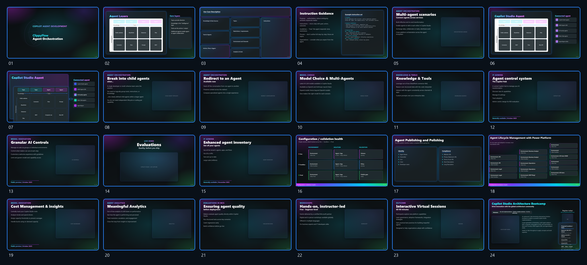

# ClippySlide

**A ClippyFlow-first slide design system for premium, dark, agentic presentations.**

ClippySlide now defaults to **ClippyFlow**: a deep-navy spectrum canvas, translucent navy cards, spectrum-gradient titles, and nitrous-blue structural rims. The original CoE token extraction remains available as legacy assets, but new slides, the generator, the presenter, the docs, and the skill all use ClippyFlow by default.



The aesthetic: 16:9 deep-navy spectrum canvas, translucent rounded cards, spectrum title text, a single electric nitrous accent for structure, and a brand-spectrum health bar. The core rule is simple: **ClippyFlow is the default; legacy CoE assets stay available under `clippyslide-legacy.*` names.**

## What's in here

| Folder | What |
| --- | --- |
| [`design-system/`](design-system) | ClippyFlow CSS component library + token profiles (JSON / XML / YAML), plus legacy CoE profiles |
| [`generator/`](generator) | `build-deck.js` -- a zero-dependency generator that emits the ClippyFlow deck from one content model |
| [`deck/`](deck) | the generated ClippyFlow slides (standalone HTML + PNG previews) |
| [`slides-clippyflow/`](slides-clippyflow) | bespoke ClippyFlow slides and reference boards |
| [`slides/`](slides) | legacy CoE hand-authored slides |
| [`presenter/`](presenter) | `present.html` -- a viewport-grid presenter: full-bleed slides + one floating header layer |
| [`skill/`](skill) | the Clawpilot `/clippyslide` skill (8 commands + scripts + assets) |
| [`extension/`](extension) | legacy TileSlide Adaptive-Card CoE theme assets |
| [`website/`](website) | the Docusaurus wiki documenting all of the above |

## Quick start

```bash
git clone https://github.com/dayour/clippyslide.git
cd clippyslide

# look at a ClippyFlow slide
start deck/01.html              # macOS: open deck/01.html

# present the whole deck (full-bleed + floating header)
start presenter/present.html

# regenerate the deck from the content model
cd generator && node build-deck.js
```

Presenter controls: `<-/->` navigate - `F` present (fullscreen) - `H` hide header - `G` toggle measurement grid.

> **`file://` note:** the presenter loads slides into an iframe. Launch the browser with `--allow-file-access-from-files`, or serve the folder over HTTP (`npx serve .`).

## The wiki

Extensive documentation lives in [`website/`](website) (Docusaurus):

```bash
cd website
npm install
npm start        # http://localhost:3000/clippyslide/
```

It covers the [design tokens](website/docs/design-system/tokens.md), the [reproduction method](website/docs/reproduction/methodology.md), the [generator archetypes](website/docs/generator/archetypes.md), the [presenter](website/docs/presenter/overview.md), the [skill commands](website/docs/skill/commands.md), and the legacy [TileSlide extension](website/docs/extension/coe-theme.md).

## License

[MIT](LICENSE).
